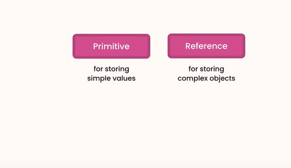
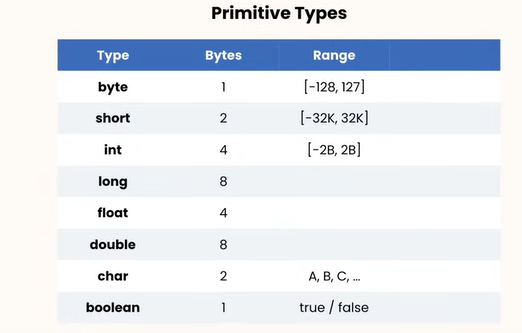
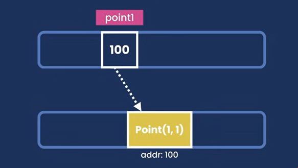
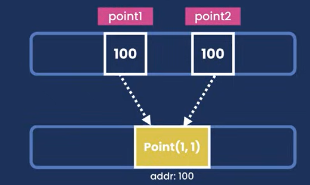
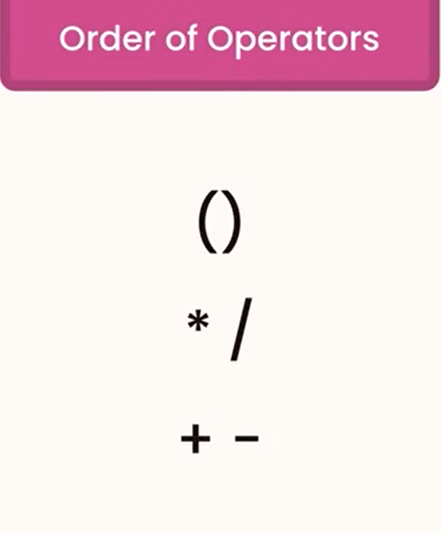
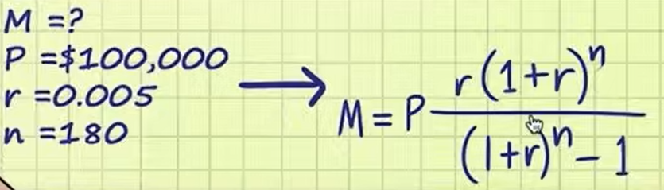
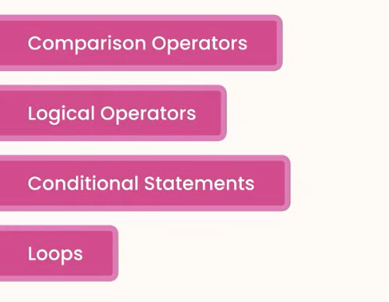

# Various types in Java:




- If we want to use long you have to use a L at the last of the value because java see's long as integer

- If we type float it will think it as a double so we have to use F at the last

## Primitive
```java
public class Main {
    public static void main(String[] args) {
        byte age = 30;
        long viewsCount = 3_123_456_789L;
        float price = 10.99F;
        char letter = 'A';
        boolean isEligible = false;

    }
}
```

## Reference 
```java
import java.util.Date;

public class Main {
    public static void main(String[] args) {
        byte age = 30;
        Date now = new Date();
        System.out.println(now);


    }
}
```
- We are using a Builtin class that is Date and while using its instance or object we are using "new" to initiate the variable and that is the main difference between primitive and reference.

### Primitive Type VS Reference Type
#### Primitive
```java
public class Main {
    public static void main(String[] args) {
        byte a = 1 ;
        byte b = a;
        a = 2;
        System.out.println(b);


    }
}
```
```plaintext
1
```
#### Reference
  


```java
import java.awt.*;

public class Main {
    public static void main(String[] args) {
        Point point1 = new Point(a:1 , y:1);
        Point point2 = point1;


    }
}
```

```java
import java.awt.*;

public class Main {
    public static void main(String[] args) {
        Point point1 = new Point(1 , 1);
        Point point2 = point1;
        point1.x=2;
        System.out.println(point2);

    }
}
```
```plaintext
java.awt.Point[x=2,y=1]
```

- Because reference types are copied by their refereces and primitives are copied by their values
```java
import java.awt.*;

public class Main {
    public static void main(String[] args) {
        Point point1 = new Point(5,6);
        Point point2 = new Point(7,8);
        point2.x = 8;
        point1.y = 9;
        System.out.println(point2+" "+point1);


    }
}
```
```sh
java.awt.Point[x=8,y=8] java.awt.Point[x=5,y=9]

Process finished with exit code 0

```

## Strings
```java
public class Main {
    public static void main(String[] args) {
        String message = "Hello world";
        System.out.println(message);

    }
}
```
#### Concatinating a string
```java
public class Main {
    public static void main(String[] args) {
        String message = "Hello world" + "!!";

        System.out.println(message);

    }
}
```
**Checking it**
```java
public class Main {
    public static void main(String[] args) {
        String message = "Hello world" + "!!";

        System.out.println(message.endsWith("!!"));

    }
}
```
```plaintext
true
```
**Finding length**
```java
public class Main {
    public static void main(String[] args) {
        String message = "Hello world" + "!!";

        System.out.println(message.length());

    }
}
```
#### Some important methods of String class

1. **length()**
   - Returns the length of the string.
   ```java
   String str = "Hello, World!";
   int length = str.length(); // 13
   ```

2. **charAt(int index)**
   - Returns the character at the specified index.
   ```java
   char ch = str.charAt(7); // 'W'
   ```

3. **indexOf(String str)**
   - Returns the index of the first occurrence of the specified substring, or -1 if not found.
   ```java
   int index = str.indexOf("World"); // 7
   ```

4. **lastIndexOf(String str)**
   - Returns the index of the last occurrence of the specified substring, or -1 if not found.
   ```java
   int lastIndex = str.lastIndexOf("o"); // 8
   ```

5. **substring(int beginIndex)**
   - Returns a new string that is a substring of this string starting from the specified index.
   ```java
   String sub = str.substring(7); // "World!"
   ```

6. **substring(int beginIndex, int endIndex)**
   - Returns a new string that is a substring of this string starting from the specified index up to, but not including, the specified end index.
   ```java
   String sub = str.substring(7, 12); // "World"
   ```
   ```sh
   1. BeginIndex will be the first index
   2. endIndex will be = endIndex + 1 
   ```

7. **toUpperCase()**
   - Converts all the characters in the string to uppercase.
   ```java
   String upper = str.toUpperCase(); // "HELLO, WORLD!"
   ```

8. **toLowerCase()**
   - Converts all the characters in the string to lowercase.
   ```java
   String lower = str.toLowerCase(); // "hello, world!"
   ```

9. **trim()**
   - Removes whitespace from both ends of the string.
   ```java
   String trimmed = "  Hello, World!  ".trim(); // "Hello, World!"
   ```

10. **replace(char oldChar, char newChar)**
    - Replaces all occurrences of the specified old character with the specified new character.
    ```java
    String replaced = str.replace('o', 'a'); // "Hella, Warld!"
    ```

11. **replace(CharSequence target, CharSequence replacement)**
    - Replaces each substring of this string that matches the literal target sequence with the specified literal replacement sequence.
    ```java
    String replaced = str.replace("World", "Java"); // "Hello, Java!"
    ```

12. **equals(Object anObject)**
    - Compares this string to the specified object. The result is true if and only if the argument is not null and is a String object that represents the same sequence of characters as this object.
    ```java
    boolean isEqual = str.equals("Hello, World!"); // true
    ```

13. **equalsIgnoreCase(String anotherString)**
    - Compares this String to another String, ignoring case considerations.
    ```java
    boolean isEqualIgnoreCase = str.equalsIgnoreCase("hello, world!"); // true
    ```

14. **contains(CharSequence s)**
    - Returns true if and only if this string contains the specified sequence of char values.
    ```java
    boolean contains = str.contains("World"); // true
    ```

15. **startsWith(String prefix)**
    - Tests if this string starts with the specified prefix.
    ```java
    boolean starts = str.startsWith("Hello"); // true
    ```

16. **endsWith(String suffix)**
    - Tests if this string ends with the specified suffix.
    ```java
    boolean ends = str.endsWith("!"); // true
    ```

17. **split(String regex)**
    - Splits this string around matches of the given regular expression.
    ```java
    String[] parts = str.split(", "); // ["Hello", "World!"]
    ```

18. **compareTo(String anotherString)**
    - Compares two strings lexicographically.
    ```java
    int comparison = str.compareTo("Hello, World!"); // 0 (if equal)
    ```

19. **isEmpty()**
    - Returns true if, and only if, length() is 0.
    ```java
    boolean empty = str.isEmpty(); // false
    ```

20. **valueOf(Object obj)**
    - Returns the string representation of the specified object.
    ```java
    String numStr = String.valueOf(123); // "123"
    ```

## Escape Sequence
```java
public class Main {
    public static void main(String[] args) {
        String message = "Hello \"Ruhan\" ";
        System.out.println(message);


    }
}
```
```plaintext
Hello "Ruhan"
```
```java
public class Main {
    public static void main(String[] args) {
        String message = "C:\\Users\\no...no\\.jdks\\openjdk-22.0.1\\bin\\java.exe";
        System.out.println(message);

    }
}
```
```plaintext
C:\Users\no...no\.jdks\openjdk-22.0.1\bin\java.exe
```
## Arrays
```java
public class Main {
    public static void main(String[] args) {
        int[] numbers = new int[5];
        numbers[0] = 1;
        numbers[3]=2;
        System.out.println(numbers);
    }
}
```
```sh
[I@7b23ec81
```
- its just printing the the address of the array

```java
import java.util.Arrays;

public class Main {
    public static void main(String[] args) {
        int[] numbers = new int[5];
        numbers[0] = 1;
        numbers[3]=2;

        System.out.println(Arrays.toString(numbers));
    }
}
```
```plaintext
[1, 0, 0, 2, 0]
```
**Finding the length of the array and sorting**
```java
import java.util.Arrays;

public class Main {
    public static void main(String[] args) {
        int[] numbers = {2,3,4,5,6,4,5,34,2};
        System.out.println(numbers.length);
        System.out.println(Arrays.sort(numbers));
    }
}
```
```java
import java.util.Arrays;

public class Main {
    public static void main(String[] args) {
        int[] numbers = {2,3,4,5,6,4,5,34,2};
        Arrays.sort(numbers);
        System.out.println(numbers.length);
        System.out.println(Arrays.toString(numbers));

    }
}
```
```plaintext
9
[2, 2, 3, 4, 4, 5, 5, 6, 34]
```

## Multi Dimentional Array

### Two Dimentional 
```java
import java.util.Arrays;

public class Main {
    public static void main(String[] args) {
        int[][] numbers = new int[2][3];
        numbers[0][0]= 1;
        System.out.println(Arrays.deepToString(numbers));

    }
}
```
**Output:**
```sh
[[1, 0, 0], [0, 0, 0]]
```
**Object for Two Dimentional Array is:**
```java
Arrays.deepToString(array_name);
```

## Constants
```java
public class Main {
    public static void main(String[] args) {
       final float PI = 3.1416F;
        // after writing final we cannot chnage the variable's value

    }
}
```
1. **after writing final we cannot chnage the variable's value because it becomes a constant.**
2. **By convention we use all capital letters for constant.**

## Arithmatic Expression
1. **In java the arithmatic operations are as like C programming**
2. **For having the value of division we often need to use typecasting**

**Example:**
```java
public class Main {
    public static void main(String[] args) {
        double divisibleValue = (double)10/(double)3;
        System.out.println(divisibleValue);
    }
}
```
**Output:**
```sh
3.3333333333333335
```
3. **We have incremental and decremental operator as well**
    


## Implicit Casting
```java
public class Main {
    public static void main(String[] args) {
        // Implicit Casting
        // byte > short > int > long
        short x=5;
        int y = x+9;

        System.out.println(y);
    }
}
```
```java
public class Main {
    public static void main(String[] args) {
        // Implicit Casting
        // byte > short > int > long
        double x=5.3;
        double y = x+9;

        System.out.println(y);
    }
}
```
**->** **Java will be automatically cast the int 9 to double**
**->** **byte > short > int > long > float > double**
**->** **When there is a chance of data loss implicit casting can be used.** 

```java
public class Main {
    public static void main(String[] args) {
        // Implicit Casting
        // byte > short > int > long
        short x=5;
        int y = (int)x+9;

        System.out.println(y);
    }
}
```

**->** **When there is a string to convert to integer we can use "Integer.parseInt(var_name)"**
```java
public class Main {
    public static void main(String[] args) {
        // Implicit Casting
        // byte > short > int > long
        String x="5";
        int y = Integer.parseInt(x)+9;

        System.out.println(y);
    }
}
```
**->** **When there is a string to convert to double we can use " Double.parseDouble(var_name)"**

```java
public class Main {
    public static void main(String[] args) {
        // Implicit Casting
        // byte > short > int > long
        String x="5.6";
        double y = Double.parseDouble(x)+9;

        System.out.println(y);
    }
}
```

## Math Class
1. **We can use the math class like we used in C**
2. **We can give a round figure to a floating point number to an integer and a double to long**

```java
public class Main{
    public static void main(String[] args){

       int result = Math.round(1.1F);
       System.out.println(result);
    }
}
```
3. **We can also use ceiling i means it will give the closest greater int**
```java
public class Main{
    public static void main(String[] args){

       int result =(int)Math.ceil(1.1F); // we are using implicit int for casting the double to int
       System.out.println(result);
    }
}
```
**Output:**
```sh
2
```
4. **Some usefull methods are:**  
    - **Math.floor()**
    - **Math.max()** ~This is for checking which is the bigger value 
    - **Math.random()** ~ This is for generating random values but it is in "Double!" but its in between 0-1

    - **Math.random()x100** ~ This will give 1-100 random numbers
    - **Math.round(Math.random())** ~ this will give a round figure every time  
        - Example:

```java
            public class Main{
    public static void main(String[] args){

        int  result =(int)Math.round(Math.random()*100); // It will give the larget nearest round value
// we are using implicit int for casting the double to int
        System.out.println(result);
    }
}
```
## Formating Numbers
- **There are many class in java which are abstract so we can't instantiate them with "new". Those are like half baked cake**

#### Formating numbers as Currency
```java
import java.text.NumberFormat;

public class Main{
    public static void main(String[] args){

        NumberFormat currency = NumberFormat.getCurrencyInstance();
        String result = currency.format(1665468.1649);
        System.out.println(result);
    }
}
```
**Output:**
```sh
$1,665,468.16
```
- **Give us a string representation of the value that we have given**

#### Formating numbers as Percent
```java
import java.text.NumberFormat;

public class Main{
    public static void main(String[] args){

        NumberFormat percent = NumberFormat.getPercentInstance();
        String result = percent.format(0.56);
        System.out.println(result);
    }
}
```
**Output:**
```sh
56%
```
#### Chaining Multiple Methods Togather
```java
import java.text.NumberFormat;

public class Main{
    public static void main(String[] args){

        String result = NumberFormat.getPercentInstance().format(.56);
        
        System.out.println(result);
    }
}
```
**Output:**
```sh
56%
```
## Reading Input
- **We use Scanner to take input from a user. We can also give the scanner an input stream so that we can read data from any source.**
- **Which type of data we are going to read is determined by the "next" method call on this object.**

```java
import java.util.Scanner;

public class Main{
    public static void main(String[] args) {
        Scanner scanner = new Scanner(System.in);
        System.out.print("Enter your age:");
        byte myAge = scanner.nextByte();
        System.out.println("You are "+ myAge);
    }
}
```
```sh
Enter your age:30
You are 30
```
1. **We are not using println because println cause extra line after its being executed. For avoiding that extra line we are using print**  

```java
import java.util.Scanner;

public class Main{
    public static void main(String[] args) {
        Scanner scanner = new Scanner(System.in);
        System.out.print("Enter your Name:");
        String myName = scanner.nextLine().trim().toUpperCase();
        System.out.println("You are "+ myName);
    }
}
```
```sh
Enter your Name:   Mian AL RUhanyat
You are MIAN AL RUHANYAT
```
2. **Here, we are using nextLine to store the whole value of the string as well as the white space in between those two strings.**
3. **We are also chaining the methods together so that it will be easier for us to read and understand this code.**

## Project-1
#### Mortgage Calculator



```java

import java.text.NumberFormat;
import java.util.Scanner;

public class Main{
    public static void main(String[] args) {
        final byte Months_In_A_Year = 12;
        final byte Percent = 100;
        Scanner scanf = new Scanner(System.in);
        System.out.println("----------------Mortgage Calculator-----------------");
        System.out.print("Principle:");
        long Principle = scanf.nextLong();
        // System.out.println(Principle);
        System.out.print("Annual Interest Rate:");
        float annualInterestRate = scanf.nextFloat();
        // System.out.println(annualInterestRate);
        System.out.print("Period:");
        float Period = scanf.nextByte();
        //Calculation
        annualInterestRate= annualInterestRate/Percent/Months_In_A_Year ;
        Period = Period*Months_In_A_Year;

        double calculatingAnnualRate = (annualInterestRate*Math.pow(1+annualInterestRate,Period))/(Math.pow(1+annualInterestRate,Period)-1);
        double Mortgage = Principle*calculatingAnnualRate;
        NumberFormat currency = NumberFormat.getCurrencyInstance();
        String result = currency.format(Mortgage);
        System.out.println("----------------------------------------------------");
        System.out.println("Mortgage:"+result);
        System.out.println("----------------------------------------------------");
    }

}
```
```sh
----------------Mortgage Calculator-----------------
Principle:100000
Annual Interest Rate:3.90
Period:30
----------------------------------------------------
Mortgage:$471.67
----------------------------------------------------
```

# Control Flow


## Logical Operators
```java
public class Main{
    public static void main(String[] args) {
        boolean highIncome = true;
        boolean highCredit = true;
        boolean isEligible = highCredit || highIncome ;
        System.out.println(isEligible);
    }
}
```
**Eligible for loan**
```java
public class Main{
    public static void main(String[] args) {
        boolean highIncome = false;
        boolean highCredit = true;
        boolean hasCriminalRecords = false;
        boolean isEligible = (highCredit || highIncome) && !hasCriminalRecords ;
        System.out.println(isEligible);
    }
}
```

## Simplifying If-Else

```java
public class Main{
    public static void main(String[] args) {
        int income = 120_000;
        boolean hasHighIncome = false;
        if(income>100_000)
            hasHighIncome=true;
        else
            hasHighIncome= false;

        System.out.println(hasHighIncome);
    }
}
```
##### *Professional Way to use Condition*
```java
public class Main{
    public static void main(String[] args) {
        int income = 120_000;
        boolean hasHighIncome = (income>100_000);
        System.out.println(hasHighIncome);
    }
}
```
## The Ternary Operator

```java
public class Main{
    public static void main(String[] args) {
        int income = 120_000;
        String className = (income>100_000) ? "First":"Economy";
        System.out.println(className);
    }
}
```
## Interview Question: FizzBuzz
```java
import java.util.Scanner;

public class Main {
    public static void main(String[] args) {
        Scanner scanf = new Scanner(System.in);
        System.out.print("Number:");
        int number = scanf.nextInt();
        if(number%3==0 && number%5==0)
            System.out.println("FizzBuzz");
        else if(number%5==0)
            System.out.println("Buzz");
        else if (number%3==0)
            System.out.println("Fizz");
        else
            System.out.println(number);


    }
}
```
- **We could use nested condition here but avoiding nested is a good practice**

## While Loops

```java
import java.util.Scanner;

public class Main {
    public static void main(String[] args) {
        Scanner scanf = new Scanner(System.in);
        String input = "";
        while(!input.equals("quit")){
            System.out.print("Input:");
            input= scanf.nextLine();
            System.out.println(input.toLowerCase());

        }
    }
}
```
```sh
Input:hello world
hello world
Input:how are you>
how are you>
Input:quit
quit

Process finished with exit code 0
```

## For-Each Loop
```java
public class Main {
    public static void main(String[] args){
        String[] Array = {"Apple","Komola","Anggur","Kola"};
        //Normal For loop
        for(int i =0;i<Array.length;i++)
            System.out.println(Array[i]);
        // For each Loop
        for(String fruit:Array)
            System.out.println(fruit);

    }
}
```
**Limitations of For-each loop**  
- We can go only forward . we can't come backward 
- We don't have the access of index 
